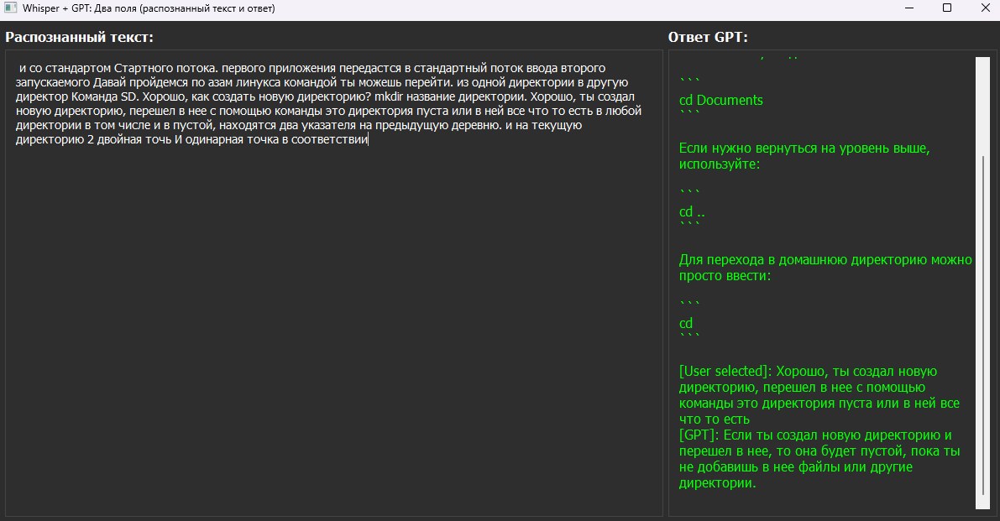

# 🚀 CrackTheInterview (English Version)

<p align="center">
  
  
  
  
</p>

<p align="center">
  <b>Automated Interview Assistant powered by Whisper and GPT</b><br>
  <i>Local speech recognition and intelligent responses</i>
</p>

---

## 📋 Description

**CrackTheInterview** is a Python tool that helps you succeed in interviews by using local Whisper model for speech recognition and GPT for response generation. The application runs on Windows with an NVIDIA graphics card.

<p align="center">
  
</p>

## ✨ Features

- 🎙️ Local speech recognition using Whisper
- 🧠 Response generation using OpenAI GPT models
- ⚡ GPU acceleration for maximum performance
- 🔄 Audio capture from any application (Zoom, Teams, Discord, etc.)
- 🛠️ Flexible customization for specific positions and requirements

## 🔧 Requirements

- Windows
- NVIDIA graphics card with CUDA support
- Python 3.8+
- VB-Audio CABLE for audio capture

## 💻 Installation

1. **Clone the repository:**
   ```bash
   git clone https://github.com/etosheartem/CrackTheInterview-.git
   cd CrackTheInterview-
   ```

2. **Create a virtual environment:**
   ```bash
   python -m venv myenv
   myenv\Scripts\activate
   ```

3. **Install dependencies:**
   ```bash
   python -m pip install --upgrade pip
   pip install -r requirements.txt
   ```

4. **Run the application:**
   ```bash
   python .\speech_to_text.py
   ```

## ⚙️ Configuration

### 1. CUDA Support Check

If you see "CUDA available? False" message at startup, follow these steps:

1. Check your CUDA version:
   ```bash
   nvcc --version
   ```

2. Reinstall PyTorch with the appropriate CUDA version support:
   ```bash
   pip uninstall torch torchvision
   pip install torch torchvision torchaudio --index-url https://download.pytorch.org/whl/cu121
   ```

<details>
<summary><b>CUDA and PyTorch Version Compatibility</b></summary>

| CUDA Version | PyTorch Command |
|--------------|-----------------|
| CUDA 12.8    | `pip install torch torchvision torchaudio --index-url https://download.pytorch.org/whl/cu121` |
| CUDA 12.1    | `pip install torch torchvision torchaudio --index-url https://download.pytorch.org/whl/cu121` |
| CUDA 11.7    | `pip install torch torchvision torchaudio --index-url https://download.pytorch.org/whl/cu117` |
| CUDA 11.3    | `pip install torch torchvision torchaudio --index-url https://download.pytorch.org/whl/cu113` |
| CUDA 10.2    | `pip install torch torchvision torchaudio --index-url https://download.pytorch.org/whl/cu102` |

</details>

### 2. Whisper Configuration

In `speech_to_text.py`, configure the Whisper model:

```python
model = whisper.load_model("large-v3-turbo", device="cuda")
```

<details>
<summary><b>Available Whisper Models</b></summary>

- **tiny**: The most compact model with minimal accuracy and maximum speed
- **base**: Small model with basic accuracy
- **small**: Medium-sized model with a good balance of speed and accuracy
- **medium**: Advanced model for complex recognition tasks
- **large-v2**: Large model with high accuracy (2022)
- **large-v3**: Improved version with enhanced accuracy
- **large-v3-turbo**: Optimized version for fast operation (recommended for RTX 3070 Ti)

</details>

### 3. OpenAI API Setup

1. Provide your OpenAI API key in `speech_to_text.py` (line 35)
2. Select your preferred model:
   ```python
   model="gpt-4o-mini"  # Recommended for most tasks
   ```

### 4. Prompt Customization

Edit the prompt for your specific position:

```python
{"role": "system", "content": "This is an interview for the position of ***Job Title***. You should answer questions concisely and clearly in English. You should not ask questions, only answer them."},
{"role": "user", "content": f"Process the following text, it may contain errors, ignore them or infer the answer: {text}"}
```

### 5. Audio Capture Setup

1. Download and install [VB-Audio CABLE](https://vb-audio.com/Cable/)

2. **Detailed configuration:**
   1. Right-click on the sound icon in the system tray and select "Open Volume Mixer"
   2. Select the application from which you want to capture audio (Telegram/Zoom/browser, etc.)
      - Using Google Chrome as an example: to display it, there must be sound coming from it (play a video or music)
      - Output device: CABLE Input
      - Input device: default
   
   3. To continue hearing the sound:
      - Right-click on the sound icon in the system tray
      - Select "Sound settings" → at the very bottom "Sound control panel"
      - Go to the "Recording" tab → "CABLE Output" → "Listen"
      - Check "Listen to this device" and select your headphones/speakers
      - After applying the settings, you should hear sounds from the browser

3. **Verifying operation:**
   - After configuration, return to the CrackTheInterview application
   - You should now see the processed audio in the interface
   - When you select the recognized speech text, the GPT response will appear in the right window

## 🔍 Troubleshooting

- **Low recognition accuracy**: Try a larger model or improve audio quality
- **Slow performance**: Make sure GPU is being used (`device="cuda"`)
- **Installation errors**: Check compatibility between CUDA and PyTorch versions

## 💖 Support the Project

If you like this project, you can support the developer:

- **USDT TRC20**: `TCpmyqG8Df4SaKhinXFqfSgbmmGQw5b66K`
- **BTC**: `14nZsN8H2iWFRRHszHZRp6bk1nCxodnSZ9`


---

# 🚀 CrackTheInterview

<p align="center">
  
  
  
  
</p>

<p align="center">
  <b>Автоматизированный помощник для собеседований на основе Whisper и GPT</b><br>
  <i>Локальное распознавание речи и интеллектуальные ответы</i>
</p>

---

## 📋 Описание

**CrackTheInterview** — это Python-инструмент, который помогает успешно проходить собеседования, используя локальную модель Whisper для распознавания речи и GPT для формирования ответов. Приложение работает на Windows с видеокартой NVIDIA.

<p align="center">
  
</p>

## ✨ Возможности

- 🎙️ Локальное распознавание речи с помощью Whisper
- 🧠 Генерация ответов с использованием моделей OpenAI GPT
- ⚡ Работа на GPU для максимальной производительности
- 🔄 Перехват звука из любого приложения (Zoom, Teams, Discord и др.)
- 🛠️ Гибкая настройка под конкретные должности и требования

## 🔧 Требования

- Windows
- Видеокарта NVIDIA с поддержкой CUDA
- Python 3.8+
- VB-Audio CABLE для перехвата звука

## 💻 Установка

1. **Клонируйте репозиторий:**
   ```bash
   git clone https://github.com/etosheartem/CrackTheInterview-.git
   cd CrackTheInterview-
   ```

2. **Создайте виртуальное окружение:**
   ```bash
   python -m venv myenv
   myenv\Scripts\activate
   ```

3. **Установите зависимости:**
   ```bash
   python -m pip install --upgrade pip
   pip install -r requirements.txt
   ```

4. **Запустите приложение:**
   ```bash
   python .\speech_to_text.py
   ```

## ⚙️ Настройка

### 1. Проверка поддержки CUDA

Если при запуске вы видите сообщение "CUDA доступна? False", выполните следующие шаги:

1. Проверьте версию CUDA:
   ```bash
   nvcc --version
   ```

2. Переустановите PyTorch с поддержкой нужной версии CUDA:
   ```bash
   pip uninstall torch torchvision
   pip install torch torchvision torchaudio --index-url https://download.pytorch.org/whl/cu121
   ```

<details>
<summary><b>Совместимость версий CUDA и PyTorch</b></summary>

| CUDA Version | PyTorch Command |
|--------------|-----------------|
| CUDA 12.8    | `pip install torch torchvision torchaudio --index-url https://download.pytorch.org/whl/cu121` |
| CUDA 12.1    | `pip install torch torchvision torchaudio --index-url https://download.pytorch.org/whl/cu121` |
| CUDA 11.7    | `pip install torch torchvision torchaudio --index-url https://download.pytorch.org/whl/cu117` |
| CUDA 11.3    | `pip install torch torchvision torchaudio --index-url https://download.pytorch.org/whl/cu113` |
| CUDA 10.2    | `pip install torch torchvision torchaudio --index-url https://download.pytorch.org/whl/cu102` |

</details>

### 2. Настройка Whisper

В файле `speech_to_text.py` настройте используемую модель Whisper:

```python
model = whisper.load_model("large-v3-turbo", device="cuda")
```

<details>
<summary><b>Доступные модели Whisper</b></summary>

- **tiny**: Самая компактная модель с минимальной точностью и максимальной скоростью
- **base**: Небольшая модель с базовой точностью
- **small**: Средняя модель с хорошим балансом скорости и точности
- **medium**: Продвинутая модель для сложных задач распознавания
- **large-v2**: Крупная модель с высокой точностью (2022)
- **large-v3**: Улучшенная версия с повышенной точностью
- **large-v3-turbo**: Оптимизированная версия для быстрой работы (рекомендуется для RTX 3070 Ti)

</details>

### 3. Настройка OpenAI API

1. Укажите ваш ключ OpenAI API в файле `speech_to_text.py` (строка 35)
2. Выберите предпочтительную модель:
   ```python
   model="gpt-4o-mini"  # Рекомендуется для большинства задач
   ```

### 4. Настройка промпта

Отредактируйте промпт под конкретную должность:

```python
{"role": "system", "content": "Проводится собеседование на должность ***Должность***, ты должен отвечать на вопросы кратко и понятно. На русском языке. Ты не должен задавать вопросы, только отвечать на них"},
{"role": "user", "content": f"Обработай следующий текст, он может содержать ошибки, игнорируй их, или додумай ответ: {text}"}
```

### 5. Настройка перехвата звука

1. Загрузите и установите [VB-Audio CABLE](https://vb-audio.com/Cable/)

2. **Подробная настройка:**
   1. Щелкните правой кнопкой мыши по иконке звука в трее и выберите "Открыть микшер громкости"
   2. Выберите приложение, откуда нужно производить запись (Telegram/Zoom/браузер и т.д.)
      - На примере Google Chrome: для отображения необходимо, чтобы оттуда исходил звук (включите видео или музыку)
      - Устройство вывода: CABLE Input
      - Устройство ввода: по умолчанию
   
   3. Чтобы продолжать слышать звук:
      - Щелкните правой кнопкой мыши по иконке звука в трее
      - Выберите "Параметры звука" → в самом низу "Дополнительные параметры звука"
      - Перейдите на вкладку "Запись" → "CABLE Output" → "Прослушать"
      - Поставьте галочку "Прослушивать с данного устройства" и выберите свои наушники/динамики
      - После применения настроек вы должны слышать звуки с браузера

3. **Проверка работы:**
   - После настройки вернитесь к приложению CrackTheInterview
   - Теперь вы должны видеть обработанный звук в интерфейсе
   - При выделении текста распознанной речи, в правом окне появится ответ от GPT

## 🔍 Устранение неполадок

- **Низкая точность распознавания**: Попробуйте модель большего размера или улучшите качество звука
- **Медленная работа**: Убедитесь, что используется GPU (`device="cuda"`)
- **Ошибки установки**: Проверьте совместимость версий CUDA и PyTorch

## 💖 Поддержка проекта

Если вам нравится проект, вы можете поддержать разработчика:

- **USDT TRC20**: `TCpmyqG8Df4SaKhinXFqfSgbmmGQw5b66K`
- **BTC**: `14nZsN8H2iWFRRHszHZRp6bk1nCxodnSZ9`

---

